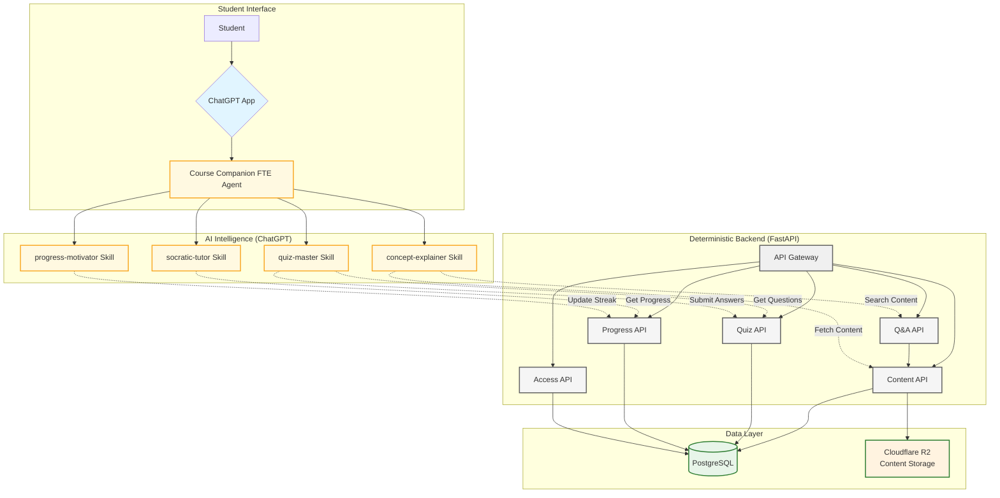
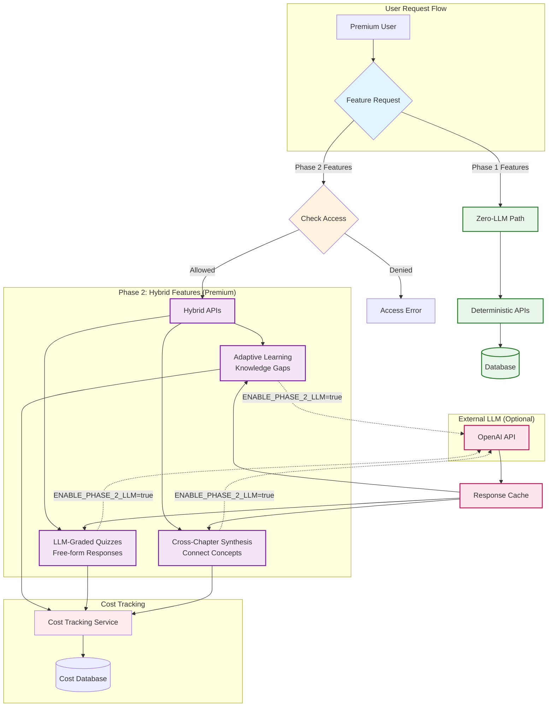
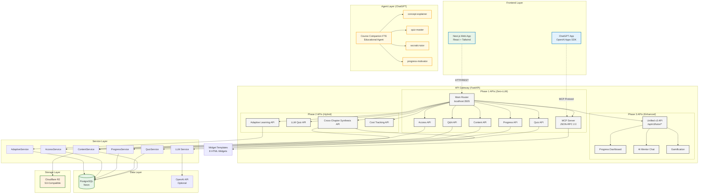
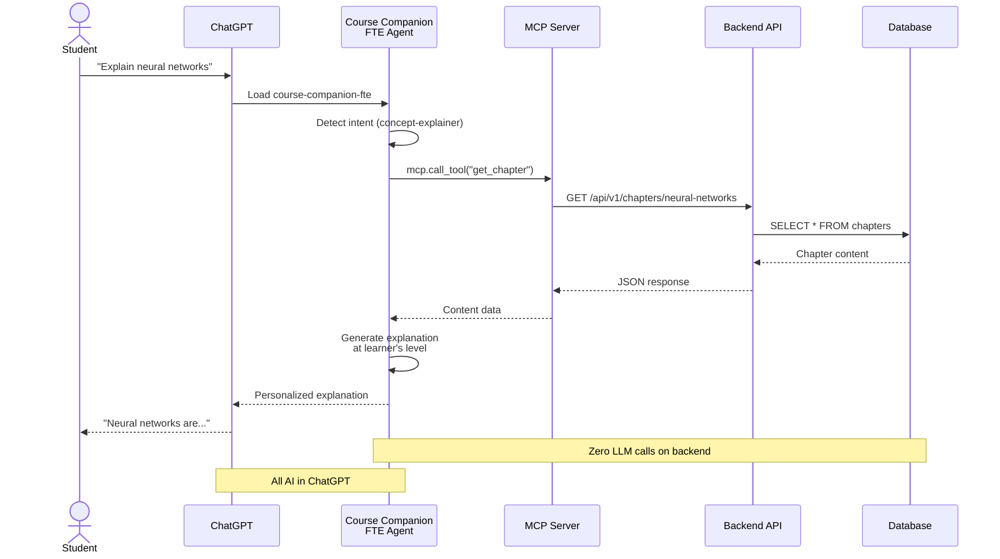
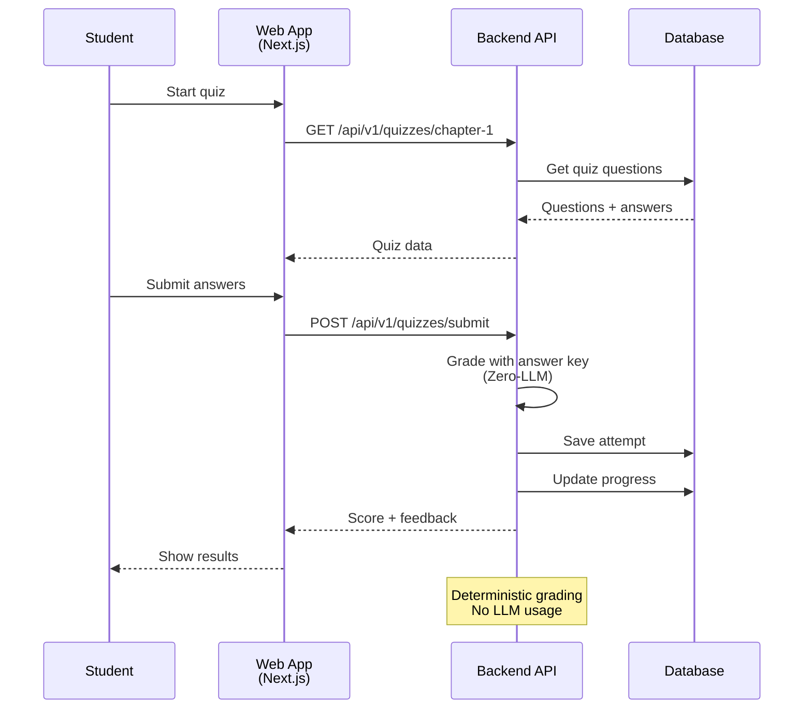
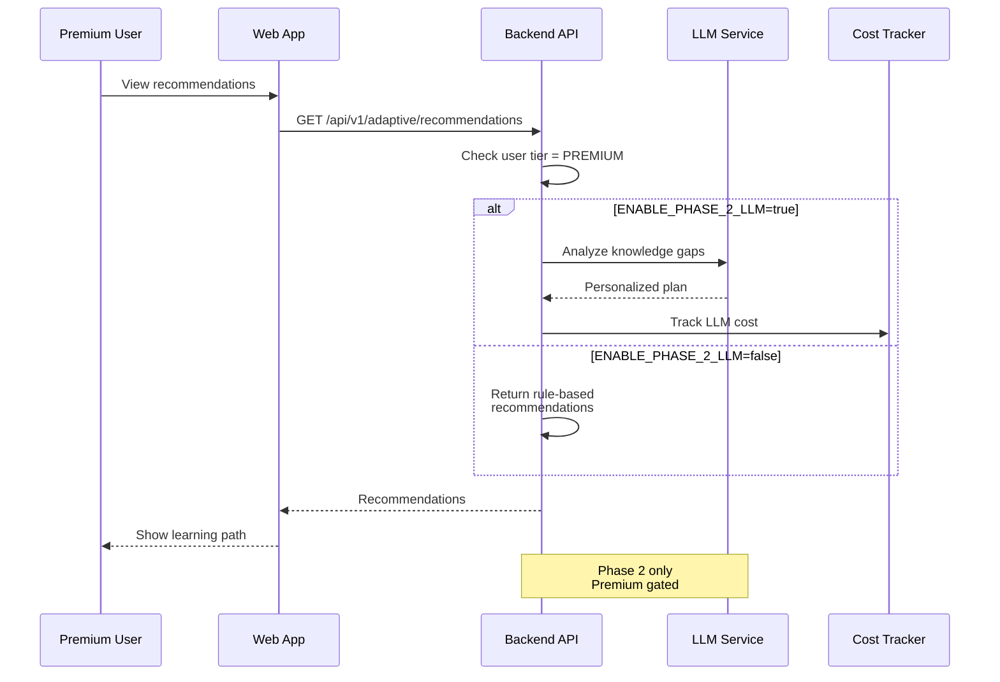
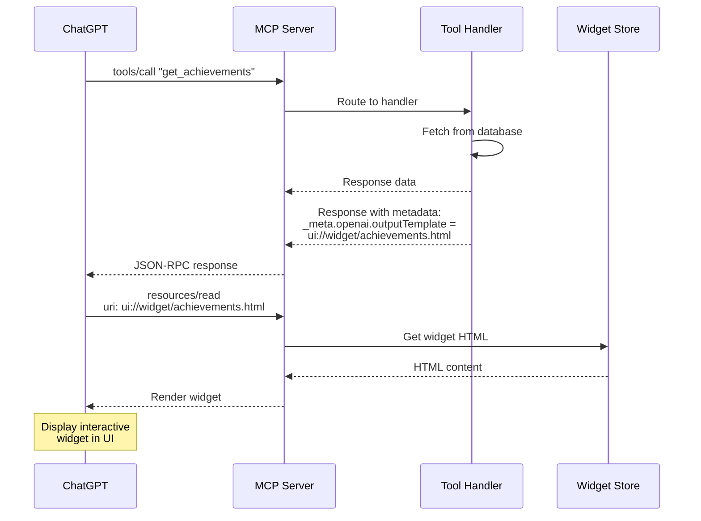
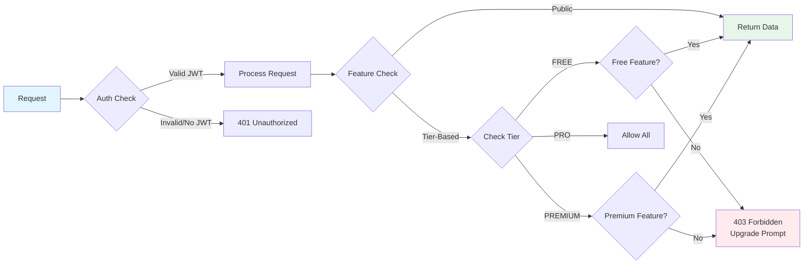

# Course Companion FTE - Architecture Diagrams

**Project**: Course Companion FTE (Digital Full-Time Equivalent Educational Tutor)
**Hackathon**: Panaversity Agent Factory Hackathon IV
**Date**: February 2026

---

## Table of Contents

1. [Phase 1: Zero-Backend-LLM Architecture](#diagram-1-phase-1-zero-backend-llm-flow)
2. [Phase 2: Hybrid Intelligence Architecture](#diagram-2-phase-2-hybrid-architecture)
3. [Full System Architecture](#diagram-3-full-system-architecture)
4. [Data Flow Diagrams](#diagram-4-data-flows)

---

## Diagram 1: Phase 1 - Zero-Backend-LLM Flow

### Core Principle
Backend serves content **deterministically** (no LLM calls). All AI intelligence happens in ChatGPT.



### Key Characteristics

| Component | Backend Does | ChatGPT Does |
|-----------|--------------|--------------|
| **Content Delivery** | Serve verbatim chapters | Explain at learner's level |
| **Navigation** | Return next/previous | Suggest optimal learning path |
| **Q&A** | Return relevant sections | Answer using content only |
| **Quizzes** | Grade with answer key | Present, encourage, explain |
| **Progress** | Store completion, streaks | Celebrate, motivate |
| **Access** | Check tier, enforce gates | Explain premium gracefully |

### Cost Impact
- **Per-User Cost**: $0.002-0.004 per month
- **Scaling**: 10 to 100,000+ users without linear cost increase
- **LLM Costs**: $0 (all LLM usage in ChatGPT, user pays)

---

## Diagram 2: Phase 2 - Hybrid Architecture

### Premium Features with Controlled LLM Usage



### Feature Gating Matrix

| Feature | FREE | PREMIUM | PRO | LLM Used |
|---------|------|---------|-----|----------|
| Content Delivery | ✅ | ✅ | ✅ | ❌ |
| Rule-Based Quizzes | ✅ | ✅ | ✅ | ❌ |
| Progress Tracking | ✅ | ✅ | ✅ | ❌ |
| **Adaptive Learning** | ❌ | ✅ | ✅ | ✅ |
| **LLM Quiz Grading** | ❌ | ❌ | ✅ | ✅ |
| **Cross-Chapter Synthesis** | ❌ | ✅ | ✅ | ✅ |
| Cost Tracking | Hidden | Visible | Detailed | - |

### Environment Control
```bash
# Disable Phase 2 (Phase 1 compliance)
ENABLE_PHASE_2_LLM=false

# Enable Phase 2 (default)
ENABLE_PHASE_2_LLM=true
```

---

## Diagram 3: Full System Architecture

### Complete Implementation Stack



### Technology Stack

| Layer | Technology | Purpose |
|-------|-----------|---------|
| **ChatGPT Frontend** | OpenAI Apps SDK | Conversational interface |
| **Web Frontend** | Next.js 14, React, Tailwind | Standalone web app |
| **Backend API** | FastAPI, Python 3.11 | RESTful API |
| **Database** | PostgreSQL (Neon) | User data, progress |
| **Storage** | Cloudflare R2 | Content files (S3-compatible) |
| **MCP Protocol** | JSON-RPC 2.0 | ChatGPT integration |
| **LLM (Optional)** | OpenAI API | Phase 2 premium features |
| **Deployment** | Docker, Fly.io | Container orchestration |

---

## Diagram 4: Data Flows

### Flow A: ChatGPT App Learning Session



### Flow B: Web App Quiz Flow



### Flow C: Phase 2 Adaptive Learning (Premium)



### Flow D: MCP Widget Rendering



---

## Widget Integration Architecture

### Available Widgets (8 Total)

| Widget | Tool Trigger | Template URI |
|--------|--------------|--------------|
| Chapter List | `list_chapters` | `ui://widget/chapter-list.html` |
| Quiz Widget | `get_quiz` | `ui://widget/quiz.html` |
| Achievements | `get_achievements` | `ui://widget/achievements.html` |
| Streak Calendar | `get_streak_calendar` | `ui://widget/streak-calendar.html` |
| Progress Dashboard | `get_progress_summary` | `ui://widget/progress-dashboard.html` |
| Quiz Insights | `get_quiz_score_history` | `ui://widget/quiz-insights.html` |
| Adaptive Learning | `get_recommendations` | `ui://widget/adaptive-learning.html` |
| AI Mentor Chat | `chat_with_mentor` | `ui://widget/ai-mentor-chat.html` |

### Widget Metadata Structure

```json
{
  "result": {
    "achievements": [...],
    "_meta": {
      "openai": {
        "outputTemplate": "ui://widget/achievements.html"
      }
    }
  }
}
```

---

## Deployment Architecture

### Infrastructure Map

```
┌─────────────────────────────────────────────────────────┐
│                    Production Cloud                      │
├─────────────────────────────────────────────────────────┤
│                                                          │
│  ┌──────────────────────────────────────────────────┐  │
│  │  Fly.io (Docker Container)                       │  │
│  │  ┌────────────────────────────────────────────┐  │  │
│  │  │  course-backend                            │  │  │
│  │  │  - FastAPI (uvicorn)                       │  │  │
│  │  │  - Port: 3505                              │  │  │
│  │  │  - Restart: unless-stopped                 │  │  │
│  │  └────────────────────────────────────────────┘  │  │
│  │                        ↓                         │  │
│  │  ┌────────────────────────────────────────────┐  │  │
│  │  │  MCP Server (Integrated)                    │  │  │
│  │  │  - 41 Tools                                │  │  │
│  │  │  - 8 Widgets                               │  │  │
│  │  └────────────────────────────────────────────┘  │  │
│  └──────────────────────────────────────────────────┘  │
│                         ↓                               │
│  ┌──────────────────────────────────────────────────┐  │
│  │  Neon (PostgreSQL)                               │  │
│  │  - Users, Progress, Quizzes, Attempts           │  │
│  │  - Connection: String-based                     │  │
│  └──────────────────────────────────────────────────┘  │
│                         ↓                               │
│  ┌──────────────────────────────────────────────────┐  │
│  │  Cloudflare R2 (S3-Compatible)                  │  │
│  │  - Chapter content (Markdown/HTML)              │  │
│  │  - Widget HTML templates                        │  │
│  └──────────────────────────────────────────────────┘  │
│                                                          │
│  Server: n00bi2761@92.113.147.250:3505                  │
└─────────────────────────────────────────────────────────┘
```

---

## Security & Access Control

### API Authentication Flow



---

## Performance Characteristics

### Scalability Metrics

| Metric | Phase 1 (Zero-LLM) | Phase 2 (Hybrid) | Phase 3 (Web App) |
|--------|-------------------|------------------|-------------------|
| **Concurrent Users** | 100,000+ | 10,000+ | 5,000+ |
| **API Response Time** | <100ms | 200-500ms* | <200ms |
| **Cost Per User** | $0.002-0.004/mo | $0.01-0.05/mo | $0.005-0.01/mo |
| **LLM Calls** | 0 | Limited | None (optional) |

*Phase 2 slower when LLM enabled (OpenAI API latency)

### Caching Strategy

```
┌─────────────────────────────────────────┐
│         Cache Strategy (Redis)          │
├─────────────────────────────────────────┤
│  Content: 1 hour (TTL)                  │
│  Quiz Questions: 30 minutes             │
│  Progress: 5 minutes (user-specific)    │
│  Search Results: 15 minutes             │
│  Widget HTML: Never (static)            │
└─────────────────────────────────────────┘
```

---

## Cost Analysis

### Phase 1 (Zero-LLM) - Minimum Cost

| Component | Monthly Cost | Per-User Cost (10K users) |
|-----------|-------------|---------------------------|
| Fly.io | $5-10 | $0.001 |
| Neon DB | $20-25 | $0.0025 |
| Cloudflare R2 | ~$0 | $0 |
| **Total** | **$25-35** | **$0.0035/user** |

### Phase 2 (Hybrid) - With LLM

| Component | Monthly Cost | Per-User Cost (10K users, 10% premium) |
|-----------|-------------|----------------------------------------|
| Infrastructure | $25-35 | $0.0035 |
| OpenAI API (1K users × 100 calls) | $20-30 | $0.002-0.003 |
| **Total** | **$45-65** | **~$0.006/user** |

**Cost Savings vs Human Tutor**: 85-90% reduction
**Human Tutor**: $20-50/hour × 10 hours/month = $200-500/month
**Course Companion FTE**: $0.003-0.006/month

---

## Monitoring & Observability

### Health Check Endpoints

```bash
# API Health
GET /health
Response: {"status": "healthy", "version": "1.0.0"}

# MCP Server Status
POST /api/v1/mcp
{"jsonrpc": "2.0", "id": 1, "method": "initialize"}

# Cost Tracking (Premium)
GET /api/v1/cotrary/costs/summary?user_id={uuid}
Response: { "total_cost": 0.045, "calls": 150 }
```

### Logging Strategy

```
┌──────────────────────────────────────────────────┐
│              Log Levels                          │
├──────────────────────────────────────────────────┤
│  ERROR: Failed requests, exceptions              │
│  WARNING: Access denied, feature gates           │
│  INFO: API calls, user actions                   │
│  DEBUG: LLM prompts, responses (Phase 2)         │
└──────────────────────────────────────────────────┘
```

---

## Conclusion

This architecture demonstrates a **Zero-Backend-LLM** approach for Phase 1, with **optional Phase 2 enhancements** for premium users. The design prioritizes:

1. **Cost Efficiency**: $0.002-0.004 per user per month
2. **Scalability**: 10 to 100,000+ users
3. **Flexibility**: Phase 1 compliance with optional Phase 2 features
4. **User Experience**: AI-native learning through ChatGPT
5. **Extensibility**: MCP protocol for future integrations

---

**Generated**: February 5, 2026
**Author**: Course Companion FTE Team
**Hackathon**: Panaversity Agent Factory IV
